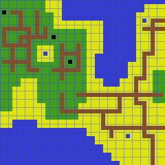
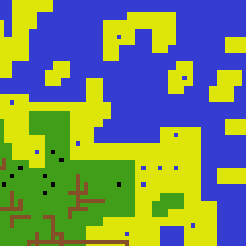
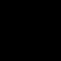
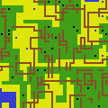
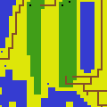

# Collapse generative algorithms

Given sample gridmaps, these algorithms can analyze the underlying tile adjacency rules and generate completely new, random maps 
in servicable speed.

Examples presented there are generated using `vis` feature, which allows reading and writing 2D gridmaps from image files, and are based on 
sample gridmaps containing tiles in size of 4x4 pixels. 

## Queues

Collapsible algorithms needs to have some order in which to collapse tiles. Two different types of *queues* are provided in `grid_forge`:

- `PositionQueue` - simple queue, moving on predetermined path (rowwise left-to-right by default). It allows for faster generation speeds, 
  but can be more error-prone, as it doesn't take into account number of possible options for given tile to be able to collapse to.
- `EntrophyQueue` - more advanced queue, taking into account the possible options and their weight. It chooses the cells by their 
  *entrophy*, choosing the one with lowest measure for the next collapse. As it needs to propagate changes, it is a little slower but have 
  much higher success rate, particularly when generating grids with some tiles already collapsed.

The decision about which *queue* to use depends on the complexity of the tiles and their rulesets, time and intended output.

## Single-tiled algorithms

Structs kept in `gen::collapse::singular` module can be used to create maps based on simple adjacency rules on single tile basis, which can 
be described as:

> For the given tile `X`, in direction `D` tiles `A`, `B`, `C` .. `N` can be placed.

Below examples are based on two provided sample images, resized and with the tile borders marked for better clarity. The tiles themselves need hold the information about their possible adjacents: e.g. half-water half-sand tile can be adjacent to water tile in one direction and sand tile in the opposite one.

`singular::IdentityAnalyzer` creates `singular::AdjacencyRules` that are strictly based on the sample grids. If a given is placed in given direction on the analyzed grid, it is a possible neighbour. 
They can be restrictive, as the tiles will be placed near themselves only if it have been so in the source image, even if *logically* they should be possible to be neighbours: e.g. tile is half-sand but can't be placed next to other sand tile. 

Below example 30x30 map generated with help of `EntrophyQueue`:

`singular::BorderAnalyzer` creates more liberate rules - it checks tiles for posible adjacent in sample map similarly to previous analyzer, but additionally creates new rules based on the tile borders. To describe it more naturally:

> If given tile X is adjacent to both tile A and tile B in direction D, they share the same border. If tile C is adjacent to tile X in direction opposite to D, tiles A and B can be placed adjacent to C in direction D.

Below example of 30x30 map generated with the help of default `PositionQueue`:

## Overlapping algorithm

Structs kept in `gen::collapse::overlap` module can be used to create maps based on 
overlapping patterns of tiles. Given some sample gridmaps `overlap::Analyzer` creates
an `PatternCollection` containing `WIDTH x HEIGHT` tiles, which afterwards the
`overlap::Resolver` will try to place on newly generated grid.

Below examples are generated based on rules derived from one sample grid, a with a little different tileset than tiles above, as the tiles don't need to be self-descriptive about their possible adjacents, so no half-tiles are there (though there are still roads present).

